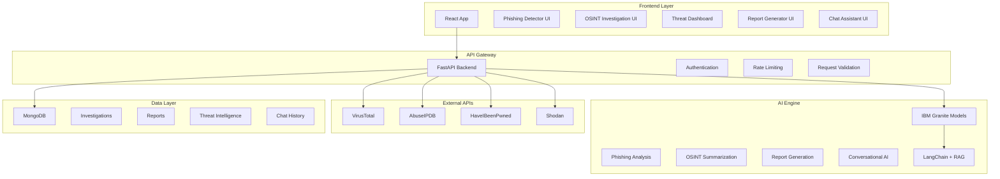

# SentinelX AI - Architecture & Implementation Plan

## Project Overview
**SentinelX AI** is an AI-powered cyber investigation and threat intelligence platform designed to help SOC teams, investigators, and security professionals analyze threats, phishing attacks, and OSINT evidence automatically.

**Timeline:** 2-3 weeks MVP
**Tech Stack:** React + FastAPI + IBM Granite + MongoDB

---

## System Architecture



---

## Project Structure

```
sentinelx-ai/
├── backend/
│   ├── app/
│   │   ├── __init__.py
│   │   ├── main.py                    # FastAPI app entry point
│   │   ├── config.py                  # Configuration management
│   │   ├── models/                    # Pydantic models
│   │   │   ├── __init__.py
│   │   │   ├── phishing.py
│   │   │   ├── osint.py
│   │   │   ├── threat.py
│   │   │   └── report.py
│   │   ├── routes/                    # API endpoints
│   │   │   ├── __init__.py
│   │   │   ├── phishing.py
│   │   │   ├── osint.py
│   │   │   ├── threat_intel.py
│   │   │   ├── reports.py
│   │   │   └── chat.py
│   │   ├── services/                  # Business logic
│   │   │   ├── __init__.py
│   │   │   ├── ai_service.py          # IBM Granite integration
│   │   │   ├── phishing_service.py
│   │   │   ├── osint_service.py
│   │   │   ├── threat_service.py
│   │   │   ├── report_service.py
│   │   │   └── chat_service.py
│   │   ├── integrations/              # External API clients
│   │   │   ├── __init__.py
│   │   │   ├── virustotal.py
│   │   │   ├── abuseipdb.py
│   │   │   ├── hibp.py
│   │   │   └── shodan.py
│   │   ├── database/                  # Database operations
│   │   │   ├── __init__.py
│   │   │   ├── mongodb.py
│   │   │   └── schemas.py
│   │   └── utils/                     # Utility functions
│   │       ├── __init__.py
│   │       ├── validators.py
│   │       ├── parsers.py
│   │       └── pdf_generator.py
│   ├── tests/
│   ├── requirements.txt
│   └── .env.example
│
├── frontend/
│   ├── public/
│   ├── src/
│   │   ├── components/
│   │   │   ├── common/               # Reusable components
│   │   │   │   ├── Button.jsx
│   │   │   │   ├── Card.jsx
│   │   │   │   ├── Modal.jsx
│   │   │   │   └── Loader.jsx
│   │   │   ├── phishing/
│   │   │   │   ├── PhishingDetector.jsx
│   │   │   │   ├── UploadZone.jsx
│   │   │   │   └── ThreatScore.jsx
│   │   │   ├── osint/
│   │   │   │   ├── OSINTInvestigator.jsx
│   │   │   │   ├── SearchForm.jsx
│   │   │   │   ├── RelationshipGraph.jsx
│   │   │   │   └── InvestigationSummary.jsx
│   │   │   ├── dashboard/
│   │   │   │   ├── ThreatDashboard.jsx
│   │   │   │   ├── AttackHeatmap.jsx
│   │   │   │   ├── ThreatTimeline.jsx
│   │   │   │   └── StatCards.jsx
│   │   │   ├── reports/
│   │   │   │   ├── ReportGenerator.jsx
│   │   │   │   ├── ReportPreview.jsx
│   │   │   │   └── ReportExport.jsx
│   │   │   └── chat/
│   │   │       ├── ChatAssistant.jsx
│   │   │       ├── MessageList.jsx
│   │   │       └── ChatInput.jsx
│   │   ├── pages/
│   │   │   ├── Home.jsx
│   │   │   ├── PhishingPage.jsx
│   │   │   ├── OSINTPage.jsx
│   │   │   ├── DashboardPage.jsx
│   │   │   ├── ReportsPage.jsx
│   │   │   └── ChatPage.jsx
│   │   ├── services/
│   │   │   └── api.js                # API client
│   │   ├── hooks/
│   │   │   └── useAPI.js
│   │   ├── utils/
│   │   │   └── helpers.js
│   │   ├── App.jsx
│   │   ├── main.jsx
│   │   └── index.css
│   ├── package.json
│   ├── vite.config.js
│   ├── tailwind.config.js
│   └── .env.example
│
├── docs/
│   ├── API.md
│   ├── DEPLOYMENT.md
│   └── USER_GUIDE.md
│
└── README.md
```

---

## Feature Implementation Details

### 1. AI Phishing Detector

**Flow:**
1. User uploads email/screenshot/URL/SMS
2. Backend extracts text and metadata
3. VirusTotal API checks URLs/attachments
4. IBM Granite analyzes content for phishing indicators
5. Generate threat score (0-100) with explanation
6. Return recommendations

**Key Components:**
- File upload handler (supports images, PDFs, text)
- URL parser and validator
- Email header analyzer
- IBM Granite prompt for phishing detection
- Threat scoring algorithm

**Database Schema:**
```javascript
{
  _id: ObjectId,
  type: "email|url|sms|file",
  content: String,
  metadata: Object,
  threat_score: Number,
  indicators: Array,
  virustotal_results: Object,
  ai_analysis: String,
  recommendations: Array,
  created_at: Date
}
```

---

### 2. OSINT Investigation Agent

**Flow:**
1. User inputs username/email/phone/domain
2. Query HaveIBeenPwned for breaches
3. Query AbuseIPDB for IP reputation
4. Search public databases (simulated for MVP)
5. IBM Granite creates investigation summary
6. Generate relationship graph
7. Calculate risk score

**Key Components:**
- Multi-source data aggregator
- Data normalization layer
- Relationship graph generator (using D3.js or vis.js)
- Risk scoring engine
- IBM Granite for summarization

**Database Schema:**
```javascript
{
  _id: ObjectId,
  target: String,
  target_type: "username|email|phone|domain",
  breach_data: Array,
  ip_reputation: Object,
  social_profiles: Array,
  relationships: Array,
  risk_score: Number,
  summary: String,
  created_at: Date
}
```

---

### 3. Threat Intelligence Dashboard

**Flow:**
1. Background job fetches data from Shodan, VirusTotal
2. Aggregate and process threat data
3. Store in MongoDB with timestamps
4. Frontend polls for updates every 30 seconds
5. Display interactive charts and heatmaps

**Key Components:**
- Background scheduler (APScheduler)
- Data aggregation pipeline
- Real-time data streaming (WebSocket optional)
- Interactive charts (Chart.js or Recharts)
- Geographic heatmap (Leaflet or Mapbox)

**Database Schema:**
```javascript
{
  _id: ObjectId,
  threat_type: "malware|phishing|ransomware|ddos",
  source: String,
  severity: String,
  location: {lat: Number, lon: Number},
  ip_address: String,
  indicators: Array,
  timestamp: Date
}
```

---

### 4. AI Incident Report Generator

**Flow:**
1. User selects incident type and provides details
2. IBM Granite generates structured report
3. Format report with sections:
   - Executive Summary
   - Timeline
   - Attack Vector
   - Affected Systems
   - Mitigation Steps
4. Generate PDF using ReportLab or WeasyPrint
5. Store report in database

**Key Components:**
- Report template engine
- IBM Granite prompt engineering for reports
- PDF generation library
- Report versioning system

**Database Schema:**
```javascript
{
  _id: ObjectId,
  incident_id: String,
  incident_type: String,
  severity: String,
  executive_summary: String,
  timeline: Array,
  attack_vector: String,
  affected_systems: Array,
  mitigation_steps: Array,
  generated_by: String,
  pdf_url: String,
  created_at: Date
}
```

---

### 5. AI Chat Assistant

**Flow:**
1. User asks question about cybersecurity
2. LangChain retrieves relevant context from knowledge base
3. IBM Granite generates response
4. Store conversation history
5. Support follow-up questions with context

**Key Components:**
- LangChain integration with IBM Granite
- RAG pipeline with vector database (ChromaDB or FAISS)
- Cybersecurity knowledge base (MITRE ATT&CK, CVE data)
- Conversation memory management
- Context-aware response generation

**Database Schema:**
```javascript
{
  _id: ObjectId,
  session_id: String,
  messages: [
    {
      role: "user|assistant",
      content: String,
      timestamp: Date
    }
  ],
  context: Array,
  created_at: Date
}
```

---

## API Endpoints

### Phishing Detection
- `POST /api/phishing/analyze` - Analyze phishing content
- `GET /api/phishing/history` - Get analysis history
- `GET /api/phishing/{id}` - Get specific analysis

### OSINT Investigation
- `POST /api/osint/investigate` - Start investigation
- `GET /api/osint/investigations` - List investigations
- `GET /api/osint/{id}` - Get investigation details

### Threat Intelligence
- `GET /api/threats/dashboard` - Get dashboard data
- `GET /api/threats/trends` - Get threat trends
- `GET /api/threats/heatmap` - Get geographic data

### Reports
- `POST /api/reports/generate` - Generate report
- `GET /api/reports` - List reports
- `GET /api/reports/{id}` - Get report
- `GET /api/reports/{id}/pdf` - Download PDF

### Chat
- `POST /api/chat/message` - Send message
- `GET /api/chat/sessions` - List sessions
- `GET /api/chat/{session_id}` - Get conversation

---

## IBM Granite Integration Strategy

### 1. Model Selection
- **granite-13b-instruct-v2** for general analysis
- **granite-20b-code-instruct** for technical explanations
- Use IBM Bob for orchestration and tool calling

### 2. Prompt Templates

**Phishing Analysis:**
```
You are a cybersecurity expert analyzing potential phishing content.

Content: {content}
Metadata: {metadata}
VirusTotal Results: {vt_results}

Analyze this content and provide:
1. Threat Score (0-100)
2. Phishing Indicators Found
3. Explanation
4. Recommended Actions

Format as JSON.
```

**OSINT Summary:**
```
You are an OSINT analyst creating an investigation summary.

Target: {target}
Breach Data: {breaches}
IP Reputation: {ip_data}
Social Profiles: {profiles}

Create a comprehensive summary including:
1. Risk Assessment
2. Key Findings
3. Potential Threats
4. Recommendations
```

**Report Generation:**
```
You are a SOC analyst writing an incident report.

Incident Type: {type}
Details: {details}
Timeline: {timeline}

Generate a professional incident report with:
1. Executive Summary
2. Detailed Timeline
3. Attack Vector Analysis
4. Affected Systems
5. Mitigation Steps
6. Recommendations
```

### 3. RAG Pipeline for Chat
- Embed MITRE ATT&CK framework
- Embed CVE database excerpts
- Embed cybersecurity best practices
- Use ChromaDB for vector storage
- Retrieve top-k relevant documents per query

---

## Security Considerations

1. **API Key Management**
   - Store in environment variables
   - Never commit to version control
   - Use secrets management in production

2. **Input Validation**
   - Sanitize all user inputs
   - Validate file uploads (type, size)
   - Rate limiting on API endpoints

3. **Data Privacy**
   - Encrypt sensitive data at rest
   - Use HTTPS for all communications
   - Implement user authentication (optional for MVP)

4. **Error Handling**
   - Never expose internal errors to users
   - Log errors securely
   - Graceful degradation when APIs fail

---

## Development Phases

### Week 1: Foundation
- Days 1-2: Project setup, environment configuration
- Days 3-4: Backend API structure, database setup
- Days 5-7: Frontend scaffolding, IBM Granite integration

### Week 2: Core Features
- Days 8-10: Phishing Detector + OSINT Investigation
- Days 11-12: Threat Intelligence Dashboard
- Days 13-14: Report Generator + Chat Assistant

### Week 3: Polish & Testing
- Days 15-17: Integration testing, bug fixes
- Days 18-19: UI/UX improvements, animations
- Days 20-21: Documentation, demo preparation

---

## Testing Strategy

1. **Unit Tests**
   - Test API integrations with mocked responses
   - Test AI prompt generation
   - Test data validation

2. **Integration Tests**
   - Test end-to-end workflows
   - Test with real API keys (limited calls)
   - Test error scenarios

3. **Manual Testing**
   - Test all UI components
   - Test with various input types
   - Performance testing

---

## Deployment Checklist

- [ ] Environment variables configured
- [ ] Database indexes created
- [ ] API rate limits configured
- [ ] Error logging setup
- [ ] CORS configured properly
- [ ] Static files optimized
- [ ] API documentation complete
- [ ] Demo scenarios prepared

---

## Success Metrics

1. **Functionality**
   - All 5 features working end-to-end
   - Real API integrations functional
   - IBM Granite responses accurate

2. **Performance**
   - API response time < 3 seconds
   - Dashboard loads < 2 seconds
   - Chat responses < 5 seconds

3. **User Experience**
   - Intuitive navigation
   - Clear error messages
   - Smooth animations
   - Responsive design

---

## Future Enhancements (Post-MVP)

1. User authentication and multi-tenancy
2. Advanced threat correlation engine
3. Automated threat hunting workflows
4. Integration with SIEM systems
5. Mobile application
6. Real-time collaboration features
7. Custom report templates
8. API for third-party integrations
9. Machine learning model training on historical data
10. Blockchain-based evidence chain of custody